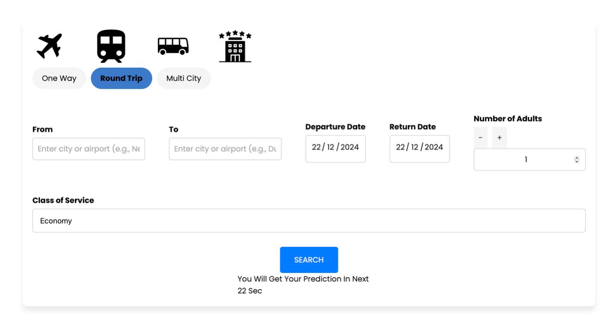
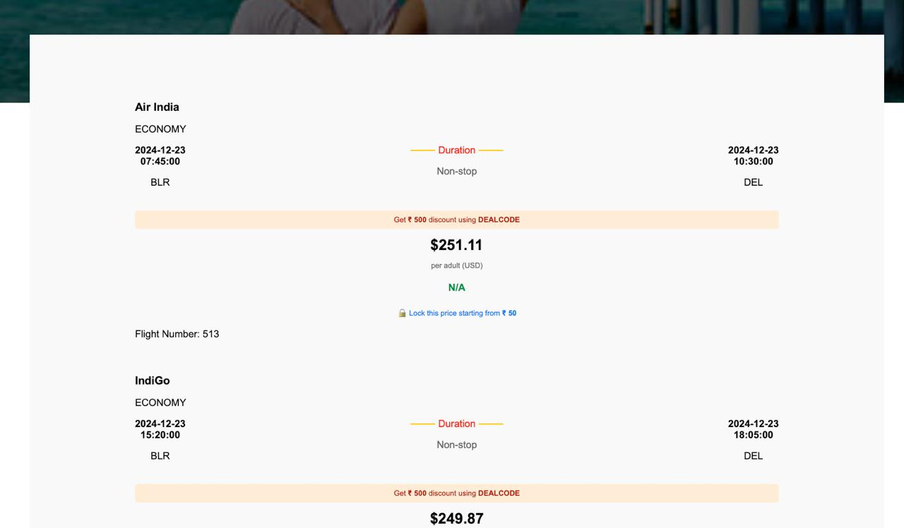

# Flight Price Prediction System 1234

Welcome to the **Flight Price Prediction System** repository! This project utilizes machine learning, data analytics, and Flask to build a predictive web application for estimating flight prices.
## Catch Our Project Presentation:
https://youtu.be/y_sNHZfQ8RE


---

## Table of Contents
- [Project Overview](#project-overview)
- [Features](#features)
- [Technologies Used](#technologies-used)
- [Installation](#installation)
- [Usage](#usage)
- [Screenshots](#screenshots)
- [Future Enhancements](#future-enhancements)
- [Contributing](#contributing)
- [License](#license)

---

## Project Overview
Flight prices can vary significantly depending on multiple factors such as time of booking, route, carrier, and more. This system leverages machine learning techniques and data analytics to create a web application that predicts flight prices based on user inputs.

The core objectives of this project include:
- Collecting and cleaning flight data for analysis.
- Implementing a predictive machine learning model.
- Creating a user-friendly interface using Flask.

## Features
- **Flight data analysis and visualization**
- **Predictive model for flight prices**
- **Interactive user input for customized predictions**
- **Responsive web interface built with Flask**

## Technologies Used
- **Programming Languages**: Python
- **Libraries and Frameworks**:
  - Flask (for web development)
  - Scikit-learn (for building the machine learning model)
  - Pandas and NumPy (for data manipulation)
  - Matplotlib and Seaborn (for data visualization)
- **Deployment**: Flask server and integration with other deployment platforms (e.g., Heroku or AWS)

## Installation
Follow these steps to set up the project on your local machine:

1. Clone this repository:
   ```bash
   git clone https://github.com/your-username/flight-price-prediction.git
   ```

2. Navigate to the project directory:
   ```bash
   cd flight-price-prediction
   ```

3. Install the required dependencies:
   ```bash
   pip install -r requirements.txt
   ```

4. Run the Flask application:
   ```bash
   python app.py
   ```

## Usage
1. Open your web browser and go to `http://127.0.0.1:5000/`.
2. Enter the required details for predicting flight prices.
3. Click on the "Predict" button to get the estimated flight price.

## Screenshots
_Add your screenshots here to showcase the user interface and prediction results._

    
    
    
  

## Future Enhancements
- Implementing more sophisticated machine learning algorithms for improved accuracy.
- Expanding the dataset to include more variables for richer analysis.
- Adding user authentication and history tracking.
- Deploying the app on cloud platforms.

## Contributing
Contributions are welcome! Please follow these steps to contribute:
1. Fork this repository.
2. Create a new branch (`git checkout -b feature/YourFeatureName`).
3. Commit your changes (`git commit -m 'Add some feature'`).
4. Push to the branch (`git push origin feature/YourFeatureName`).
5. Open a pull request.

## License
This project is licensed under the MIT License. See the [LICENSE](LICENSE) file for more information.

---

Feel free to reach out if you have any questions or suggestions!
